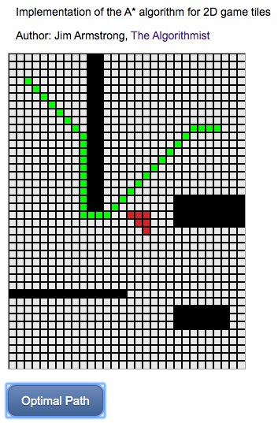

# A* For 2D tiles in Angular

This project illustrates the popular A* algorithm for 2D game tiles in Angular Version 9.  The Typescript implementation of the algorithm generally follows textbook and online discussions of the technique, so it should provide some Rosetta Code value in terms of comparing Typescript to other languages.

Angular developers should find the project a convienient testbed to both learn and experiment with the A* algorithm for tiles.

NOTE:  This code [has been updated and is now part of the AMYR library](https://github.com/theAlgorithmist/AMYR).

Author:  Jim Armstrong - [The Algorithmist]

@algorithmist

theAlgorithmist [at] gmail [dot] com

Angular: 9.0.0

Angular CLI: 9.0.1

Typescript: 3.7.5

## Introduction

A Google search will return dozens of descriptions of the A* algorithm.  It may be used for pathfinding in space with nodes that are waypoints representing begin and endpoints of a single path segment.  The optimal path represents a sequence of waypoints from a starting point to an ending point with minimal cost (time or distance, for example).  This is the fundamental approach used by mapping applications with navigation functionality such as Google Maps or Waze.

A* may also be used to find an optimal path along a sequence of 2D game tiles from a starting tile to an ending tile.  The search is generally complicated by some tiles being marked as barriers or high-cost areas to be avoided.  This approach is used in many 2D (or isometric-view) games and is the version of the algorithm implemented in this demo.

An attempt was made to make the code and even variable naming consistent with tutorials on the topic.  This should make the code easy to deconstruct and modify as well as provide some benefit in comparing Typescript to other languages.

## Setting up a grid

The logical and visual representations of a 2D grid of tiles are decoupled so that different visual representations may be used with the same logical representation of a grid.  The current demo uses a Canvas-based view that is rendered with Pixi.js.  The _Grid2D_ class, found in the _/src/app/shared/libs/grid-2d.ts_ file, encapsulates the logical layout of a 2D grid.  An optional view reference may be assigned to this class.  If that reference is set, then one call to a 2D Grid method to set a logical property also calls the relevant method in an _IGridView_ implementation to set the tile's visual representation.  You are welcome to write and assign other tile renderers, e.g. SVG.

Grid setup consists of definining non-open tiles such as barriers or high-cost areas.  These are set in an external function that is, in turn, assigned to an Angular attribute directive tasked with creating a render surface and managing the display of tiles.  This can be seen in the main app component,

```
import { grid1 } from './shared/libs/grids/grid1';
.
.
.
 @ViewChild(CanvasTileDirective, {static: true})
  private _tiles: CanvasTileDirective;
.
.
.
public ngAfterViewInit(): void
{
  this._tiles.assignGrid(grid1);
}  
```

The code for the _grid1_ function is

```
export function grid1(grid: Grid2D): void
{
  let i: number;
  let j: number = 10;

  for (i = 0; i < 20; ++i)
  {
    grid.isReachable(i, j, false);
    grid.isReachable(i, j+1, false);
  }

  i = 30;
  for (j = 0; j < 15; ++j) {
    grid.isReachable(i, j, false);
  }

  i = 18;
  for (j = 21; j < 30; ++j)
  {
    grid.isReachable(i, j, false);
    grid.isReachable(i+1, j, false);
    grid.isReachable(i+2, j, false);
    grid.isReachable(i+3, j, false);
  }

  i = 32;
  for (j = 21; j < 28; ++j)
  {
    grid.isReachable(i, j, false);
    grid.isReachable(i+1, j, false);
    grid.isReachable(i+2, j, false);
  }

  // some high-cost areas
  grid.isHazard(20, 15, 1.2);
  grid.isHazard(20, 16, 1.2);
  grid.isHazard(20, 17, 1.5);
  grid.isHazard(21, 16, 1.2);
  grid.isHazard(21, 17, 1.1);
  grid.isHazard(22, 17, 1.25);

  // and, the start/end tiles
  grid.setStartNode(3,2);
  grid.setTargetNode(9, 26);
};
```

Now, why is the grid setup deferred to the after-view init handler in the main app component, expecially since the view surface is statically defined, as can be seen in the main app component's template,

```
<div class="tileContainer" canvas-tile [cellWidth]="10"></div>
<button class="path-button mt10" (click)="onPathSelected()">Optimal Path</button>
```

The attribute directive is found in _/src/app/shared/directives/canvas-tile-directive.ts_.  The cell width is assigned as an _Input_ to that directive, which is handled in the initial call to _ngOnChanges_.  The directive's lifecyle methods run behind the equivalent parent component's handlers, so the internal grid view is not assigned in the directive until *after* the main app component's _ngOnInit_ handler.

Experiment with different grid layouts to see how the algorithm performs.


## Heuristics

The A* algorithm for tiles is heavily dependent on a heuristic to evaluate potential tile movements in the eight possible directions.  Different heuristics yield different paths.  A heuristic is given a current node and a target node and returns a numerical measure (lower is better) that indicates the relative benefit of moving from the input node to the target node.  A diagonal heuristic is provided with the current code base.  This heuristic favors moves along diagonals (like a bishop in chess).  Feel free to try different heuristics as this project was provided primarily as a testbed to learn about the A* algorithm.


## Running The Demo

Run `ng serve` for a dev server. Navigate to `http://localhost:4200/`. The default board or set of 2D tiles is displayed.  Click the 'Optimal Path' button to show the A*-generated path from source to target node.  An example is shown below.



## Build

Run `ng build` to build the project. The build artifacts will be stored in the `dist/` directory. Use the `--prod` flag for a production build.

## Further help

To get more help on the Angular CLI use `ng help` or go check out the [Angular CLI README](https://github.com/angular/angular-cli/blob/master/README.md).
